# Week 1: Introduction

### Assigned Reading

- Murphy: Chapters 1 and 2
- [Chapter 2 of David Mackay's textbook](http://www.inference.org.uk/mackay/itprnn/ps/22.40.pdf)

### Overview

- Course information
- Overview of ML with examples
- Ungraded, anonymous background quiz

### Textbook and Resources

There is no required textbook, but optional reading will be assigned each week

- Kevin Murphy (2012), _Machine Learning: A Probabilistic Perspective_.
- David MacKay (2003) _Information Theory, Inference, and Learning Algorithms_.

The David MacKay textbook is recommended, although 100% of tested material come from class.

In this course, lecture slides are more a supplement then main content. The most important stuff will be done on the blackboard, so it is important to come to class with pen and paper. Tutorial slides are relevant, but probably won't be tested.

### Assignments

Assignments must be your own individual work. You can collaborate with up to 2 other students. You should name these people in your submission. _Code should be readable_. Make sure to put all plots and important results in your PDF submission.

### Related Courses

- CSC411: List of methods, (K-NN, Decision trees), more focus on computation
- STA302: Linear regression and classical stats
- ECE521: Similar material, more focus on computation
- STA414: Mostly same material, slightly more emphasis on theory than coding
- CSC321: Neural networks - about 30% overlap

## Stats vs Machine Learning

__Statisticians__ look at the data, consider the problem, and design a model we can understand. They

- Analyze methods to give guarantees
- Want to make few assumptions

In __machine learning__, We only care about making good predictions! The basic idea is to _learn_ a general procedure that works for lots of datasets.

- Often, there is no way around making assumptions, so we make our model large enough to _hopefully_ learn something close to the truth.
- We can't use bounds in practice, so we evaluate and empirically choose model details.
- Sometimes, we end up with interpretable models anyways!

In short, statistics starts with a model _based on the data_, machine learning aims to learn a model _from_ the data.

## Types of Learning

- Unsupervised Learning: Given unlabeled data instances $x_1$, $x_2$, $x_3$... build a statistical model of $x$, which can be used for making predictions, decisions.
- Supervised Learning: Given input-output pairs $(x,y)$ the goal is to predict correct output given a new input.
- Semi-supervised Learning: We are given only a limited amount of $(x, y)$ pairs, but lots of unlabeled $x$'s
- Active learning and RL: Also get to choose actions that influence $(x, y)$ pairs, but lots of unlabeled $x$’s. future information + reward. Can just use basic decision theory.

Note that these are all just special cases of estimating distributions from data: $p(y | x)$, $p(x)$, $p(x, y)$!

## Finding Structure in Data

With a big enough dataset, we can identify structure in the data. Take a large newswire corpus, for example. A simple model based on the word counts of webpages

\\[P(x) = \frac{1}{Z} \sum_h \exp [x^TWh]\\]

could learn to discretize data into topics. In this case, our topics are our **hidden** (or [**latent**](https://en.wikipedia.org/wiki/Latent_variable)) variables.

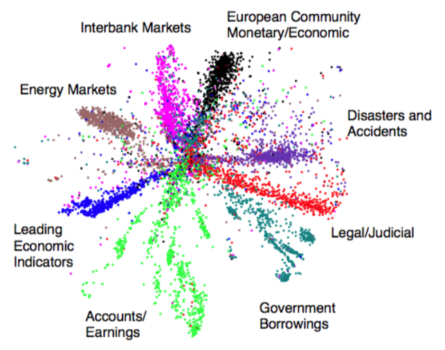

!!! note

    Sometimes latent variables correspond to aspects of physical reality, which could in principle be measured, but may not be for practical reasons. In this situation, the term hidden variables is commonly used (reflecting the fact that the variables are "really there", but hidden).

### Matrix Factorization

Lets take a look at a specific example which uses [matrix factorization](https://en.wikipedia.org/wiki/Matrix_decomposition) for [collaborative filtering](https://en.wikipedia.org/wiki/Collaborative_filtering).

Part of the winning solution in the Netflix contest started with a Netflix dataset of 480,189 users, 17,770 movies and over 100 million ratings. The job was essentially to "fill-in" the missing information in a table that looked something like the following (hence the collaborative in collaborative filtering):

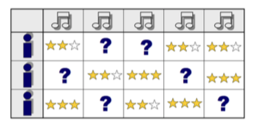

After the modal was learned, it was clear that the latent representations it learned closley mapped what we might call _genre_:

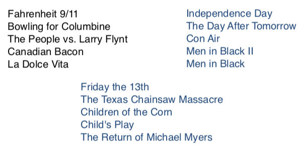

### Multiple Kinds of Data in One Model

My modeling the joint distribution of our data \(p(x, y)\), we can incorporate multiple types of data under one model. In this example, our dataset consists of both images and text.

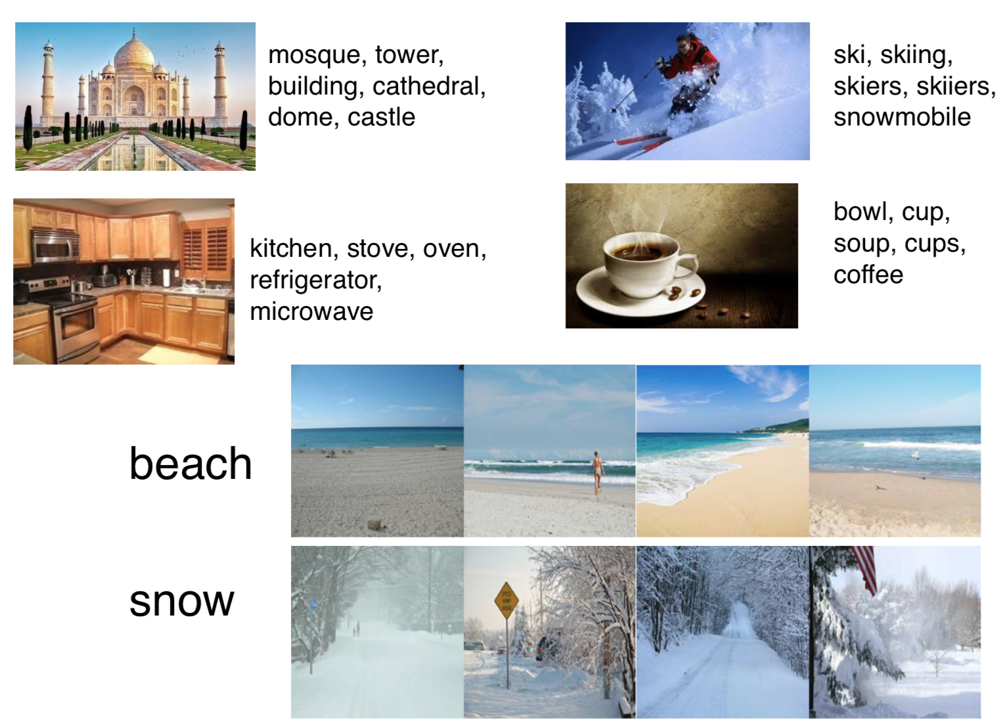

Once the joint distribution is learned, we could provide a word and ask the model to sample from the learned distribution and return a picture (or vice versa!):

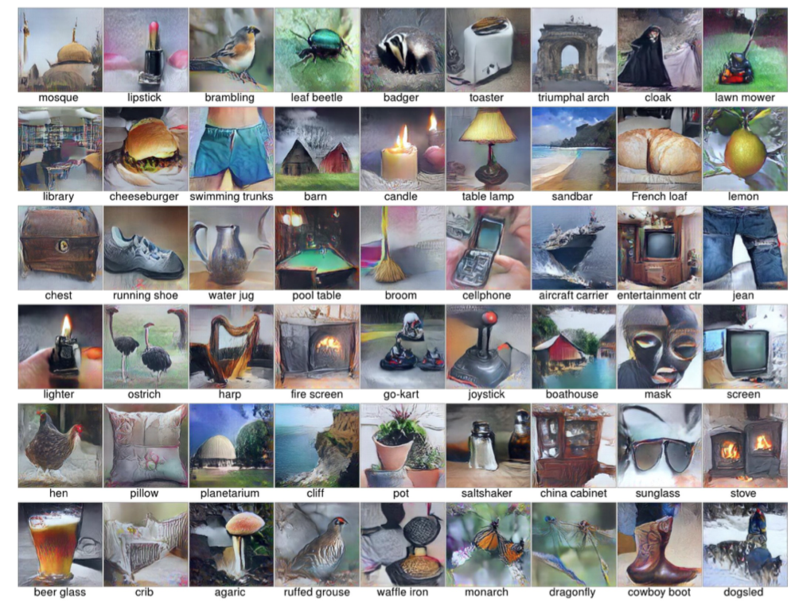

!!! info
     Nguyen A, Dosovitskiy A, Yosinski J, Brox T, Clune J (2016). Synthesizing the preferred inputs for neurons in neural networks via deep generator networks. Advances in Neural Information Processing Systems 29

In fact, this is the key idea behind image captioning models:

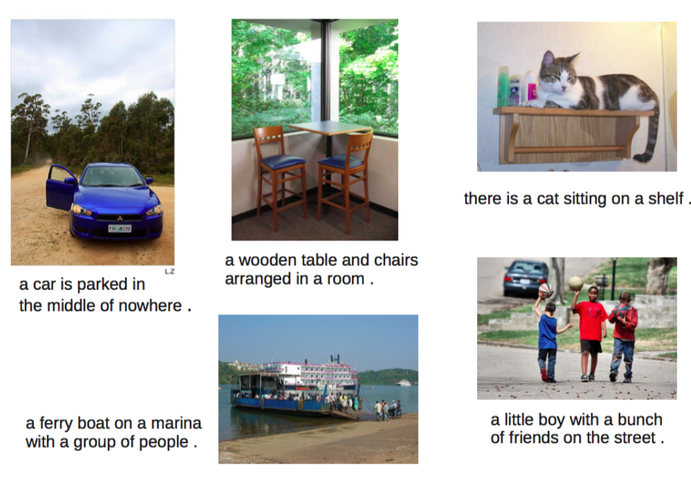

### Latent Representations

Once learned, latent representations of our data allow us to do some powerful things. For example, neural networks that are able to fill-in occuluded (or missing) portions of digital images:

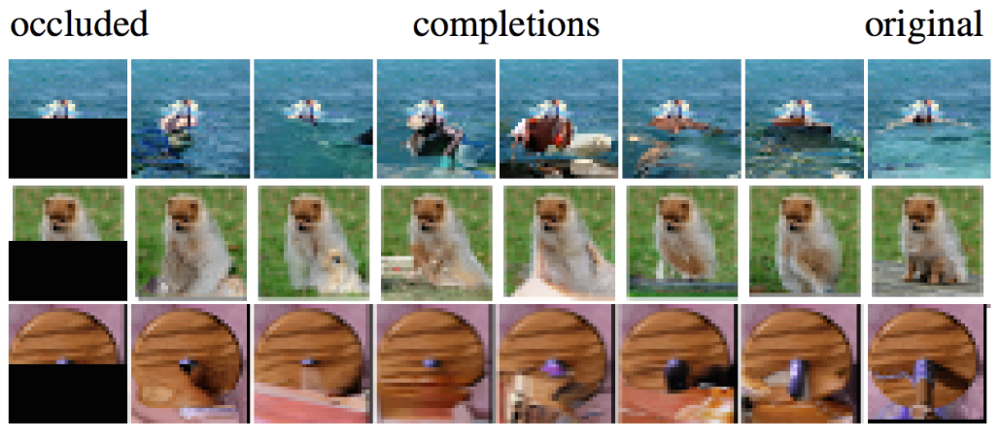

!!! info
    Pixel Recurrent Neural Networks. Aaron van den Oord, Nal Kalchbrenner, Koray Kavukcuoglu

Because our latent space is really a [**vector space**](https://en.wikipedia.org/wiki/Vector_space), we have access to all the mathematical operations that are defined on vectors, such as _addition_ and _subtraction_. Furthermore, out latent representations (which themselves are just vector learned during model training) can be decoded into images (or words, or molecules, etc!).

For example, if we were to learn latent representations of human faces, we could add and subtract these representations to create entirely new representations:

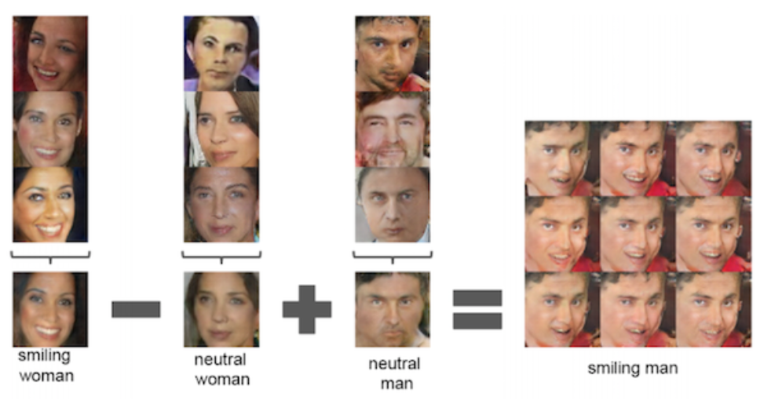

### Latent Representations of Structured Data

Some data is structured in a way that is semantically meaningful. Put another way, there is a "grammar" to the data. Take the example of molecules representing pharmaceutical drugs.

In this case, it is much more difficult to interpolate between two valid structures than it would be to interpolate between images of human faces, for example, because of the grammar of organic chemistry. Simplifying this point, two molecules that look extremely similar could in fact have wildly different behavior in the human body.

The take-home point is that we need different methods for learning latent representations of _structured_ data than _unstructured_ data

## Course Themes

This course will follow the broad theme of starting with a simple model and then adding to it.

!!! example
    Linear regression and principal component analysis (PCA) are special cases of almost everything.

A few "lego bricks" are enough to build most models (e.g. gaussians, categorical variables, linear transforms and neural networks). While the exact for of each distribution / function shouldn't mater much, your model should have a million parameters in it somewhere (the real world is messy!)

Model checking is hard, but important. Learning algorithms are especially hard to debug.

### Computation

Later assignments will involve a bit of programming. You can use whatever language you want, but `python` and `numpy` are recommended.

For fitting and inference in high-dimensional models, gradient-based methods are basically the only game in town

Lots of methods conflate model and fitting algorithm, we will try to separate these.

### ML as a Bag of Tricks

| Fast special cases        | Extensible family      |
| ------------------------- | ---------------------- |
| K-means                   | Mixture of Gaussians   |
| Kernel Density Estimation | Latent variable models |
| SVMs                      | Gaussian processes     |
| Boosting                  | Deep neural nets       |
| Random Forests            | Bayesian neural nets   |
| K-Nearest Neighbours      | ??                     |

### Regularization as a Bag of Tricks

| Fast special cases       | Extensible family                |
| ------------------------ | -------------------------------- |
| Early stopping           |                                  |
| Ensembling               |                                  |
| L2 Regularization        | Stochastic variational inference |
| Gradient noise           |                                  |
| Dropout                  |                                  |
| Expectation-Maximization |                                  |

### A Language of Models

Our goal will be to develop a language of models, a _toolbox_. For example, hidden Markov models, mixture of Gaussians, and logistic regression are all examples from a language of models. We will try to show a larger family, and point out common special cases.

Using this language, you will be able to build you own custom models.

In fact, we can talk about this family of models using very few ideas. Really, all we need are _deep probabilistic latent-variable models_ and some _decision theory_.

| Russel and Norvig’s parts of AI | Extensible family                                           |
| ------------------------------- | ----------------------------------------------------------- |
| Machine learning                |                                                             |
| Natural language processing     |                                                             |
| Knowledge representation        | Deep probabilistic latent-variable models + decision theory |
| Automated reasoning             |                                                             |
| Computer vision                 |                                                             |
| Robotics                        |                                                             |

#### Advantages of probabilistic latent-variable models

**Data-efficient Learning**

- Automatic regularization, can take advantage of more information.
- Model is aware what it doesn’t know.
- E.g. after many cat images model updates get small. Showing a dog image for the first time would lead to large updates.

**Compos-able models**

- Models are built like lego blocks.
- E.g. you could incorporate a data corruption model.

**Handle Missing & Corrupted Data**

- Latent-variable models can easily handle missing and corrupted data, without the standard hacks of guessing missing values using averages.

**Predictive Uncertainty**

- Necessary for decision-making.
- Bad models can confidently give us bad predictions. So can good modals! The key is to be able to express uncertainty.

**Conditional Predictions**

- Be able to condition predictions can be powerful.
- E.g. if brexit happens, the value of the pound will fall.

**Active Learning**

- What data would be expected to increase our confidence about a prediction.

#### Disadvantages of Probabilistic Latent-variable Models

Intractable integral over latent variables. Integrating over many dimensions is difficult and sometimes intractable.

#### Probabilistic Graphical Models Vs. Neural Networks

Imagine we had the following data

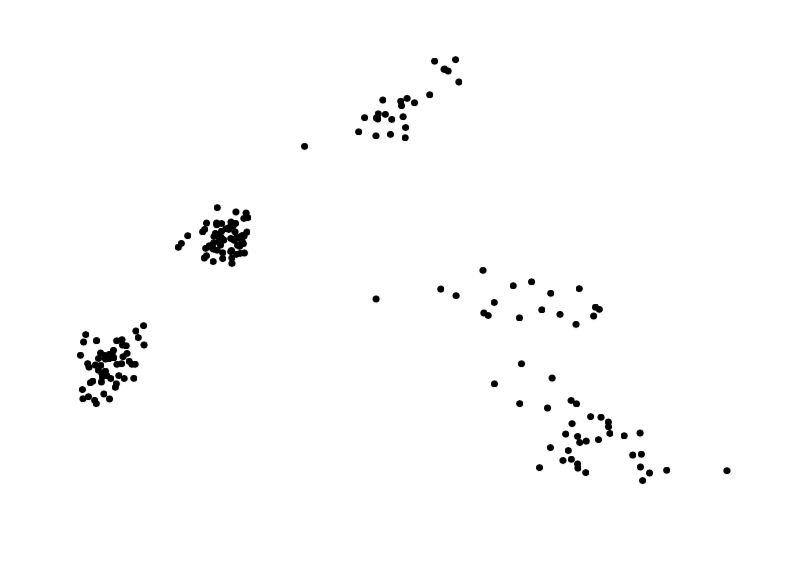

we may try to model this data by fitting a mixture of Gaussians, as so

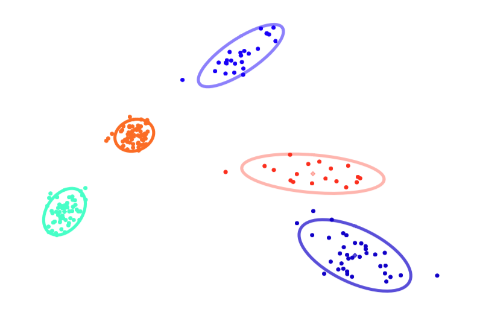

which seems perfectly reasonable in this case. However, imagine instead we had the following data

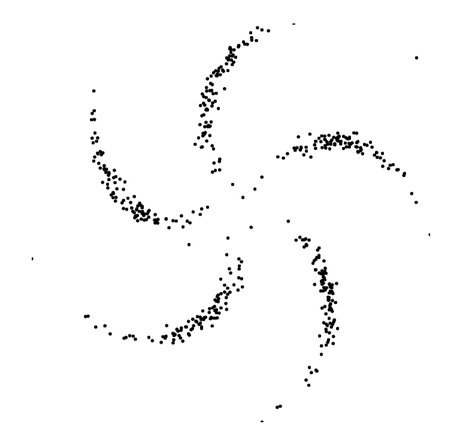

the use of a mixture model may not be appropriate in this case, as it fits the data poorly and reports too many clusters

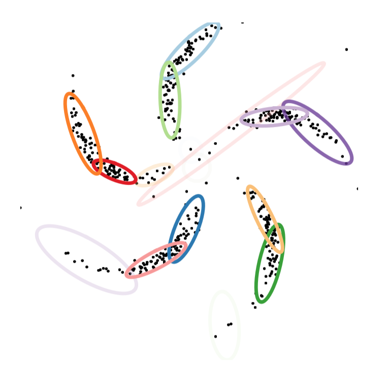

but a neural network who's job is to come up with a convincing distribution over where you can expect to see data does much better

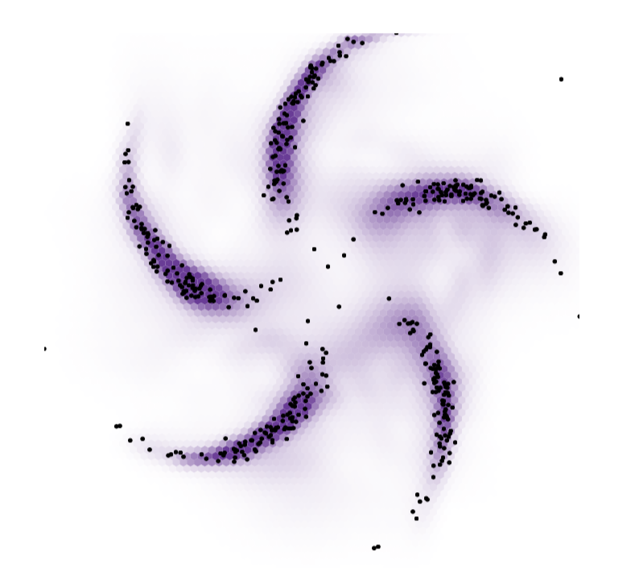

this brings us to a comparison of probabilistic graphical models and deep learning

| Probabilistic graphical models       | Deep learning                 |
| ------------------------------------ | ----------------------------- |
| ➕ structured representations        | ➖ neural net "goo"           |
| ➕ priors and uncertainty            | ➖ difficult parameterization |
| ➕ data and computational efficiency | ➖ can require lots of data   |
| ➖ rigid assumptions may not fit     | ➕ flexible                   |
| ➖ feature engineering               | ➕ feature learning           |
| ➖top-down inference                 | ➕ recognition networks       |

❗ Left off on slide 35

## The Unreasonable Easiness of Deep Learning

The deep learning recipe involves defining an __objective function__ (i.e. a probability of data given parameters) and optimizing the parameters to maximize the object. Gradients are computed automatically, you just need to define a model by some computation.

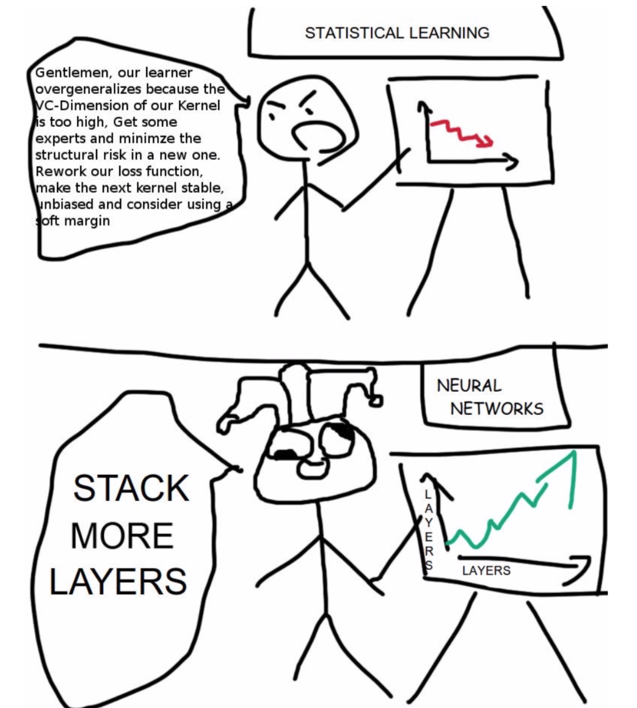

### Differentiable models

Differentiable models, in general, follow these general principals

__1. Model Distributions implicitly by a variable pushed through a deep net__

\\[y = f_{\theta}(x) ; x \sim \mathcal N(0, I) \\]

__2. Approximate intractable distribution by a tractable distribution parameterized by a deep net__

\\[p(y | x) = \mathcal N(y | \mu = f_{\theta}(x), \Sigma = g_{\theta}(x))]  ; x \sim \mathcal N(0, I) \\]

__3. Optimize all parameters using stochastic gradient descent__

### Modeling Idea

Graphical models and neural networks have complimentary strengths, and can be combined. One such way to combine these models is by using _structured prior distributions formulated as graphical models_ with _highly nonlinear observation models implemented using neural networks_.

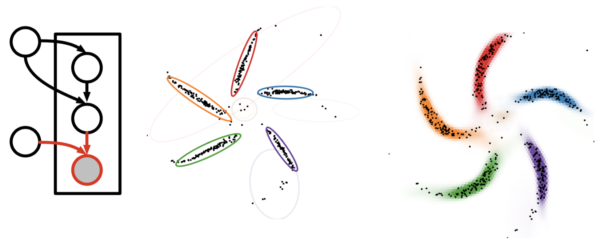

By pushing these structured prior distributions through a neural network

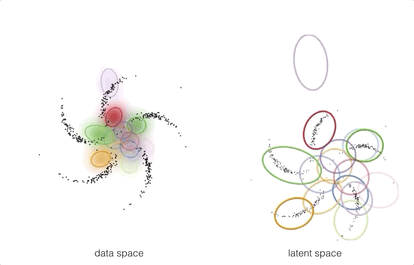

we can get a model which takes exploits the best of both worlds

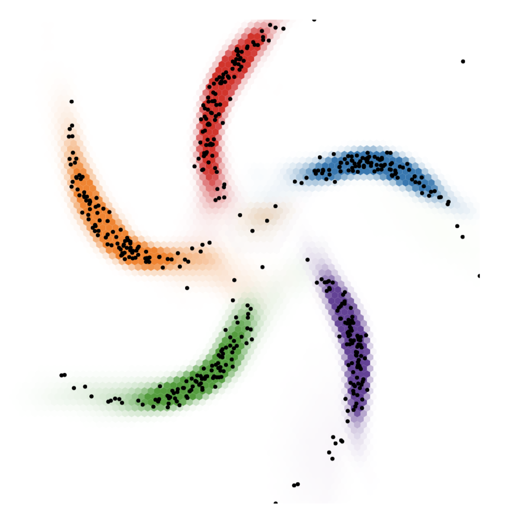

This idea can be extended to supervised or unsupervised learning

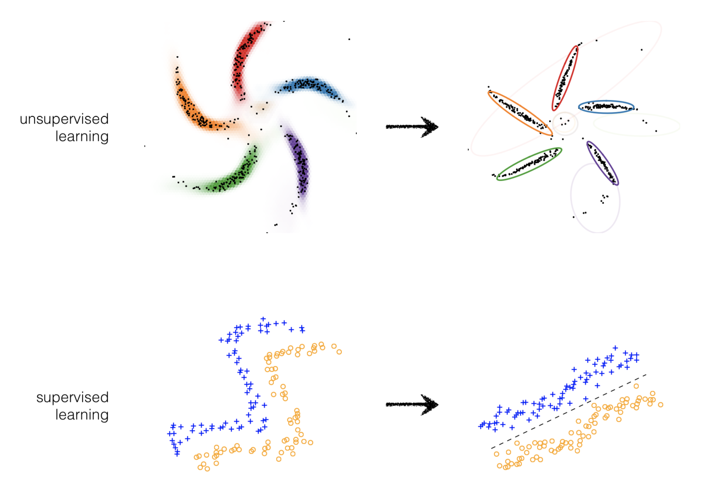

## Learning Outcomes

- Know standard algorithms (bag of tricks), when to use them, and their limitations. For basic applications and baselines.
- Know main elements of language of deep probabilistic models (bag of bricks: distributions, expectations, latent variables, neural networks) and how to combine them. For custom applications + research.
- Know standard computational tools (Monte Carlo, Stochastic optimization, regularization, automatic differentiation). For fitting models.

### Tentative List of Topics

- Linear methods for regression + classification
- Bayesian linear regression
- Probabilistic Generative and Discriminative models - Regularization methods
- Stochastic Optimization and Neural Networks
- Graphical model notation and exact inference
- Mixture Models, Bayesian Networks
- Model Comparison and marginal likelihood
- Stochastic Variational Inference
- Time series and recurrent models
- Gaussian processes
- Variational Autoencoders

### Machine-learning-centric History of Probabilistic Models

- 1940s - 1960s Motivating probability and Bayesian inference
- 1980s - 2000s Bayesian machine learning with MCMC
- 1990s - 2000s Graphical models with exact inference
- 1990s - present Bayesian Nonparametrics with MCMC (Indian Buffet
- process, Chinese restaurant process)
- 1990s - 2000s Bayesian ML with mean-field variational inference 2000s - present Probabilistic Programming
- 2000s - 2013 Deep undirected graphical models (RBMs, pretraining) 2010s - present Stan - Bayesian Data Analysis with HMC
- 2000s - 2013 Autoencoders, denoising autoencoders
- 2000s - present Invertible density estimation
- 2013 - present Stochastic variational inference, variational autoencoders
- 2014 - present Generative adversarial nets, Real NVP, Pixelnet
- 2016 - present Lego-style deep generative models (attend, infer, repeat)

## Appendix

### Useful Resources

- [Blog + tutorial](http://www.quuxlabs.com/blog/2010/09/matrix-factorization-a-simple-tutorial-and-implementation-in-python/) on matrix factorization for movie recommendation.
- [Glow](https://blog.openai.com/glow/) an interactive OpenAI blog on Generative Models.
- It appears that a few of these slides were taken straight from [this](https://www.youtube.com/watch?v=btr1poCYIzw) video.
- [Summary of notation in probability and statistics](https://en.wikipedia.org/wiki/Notation_in_probability_and_statistics).

### Glossary of Terms
