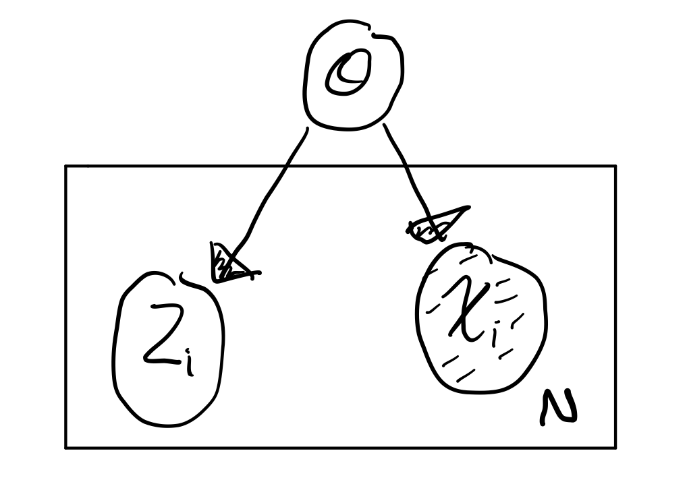
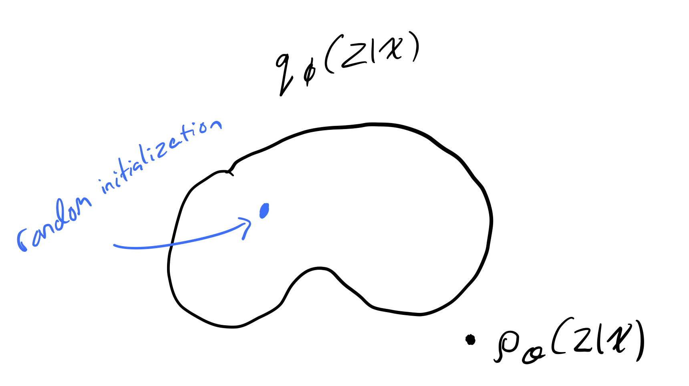

# Week 10:  Stochastic Variational Inference

### Assigned Reading

- Murphy: Chapter 18

### Overview

- Review Variational Inference
- Derive the variational objective
- ELBO intuition
- Stochastic optimization

## Posterior Inference for Latent Variable Models

Imagine we had the following latent variable model

which represents the probabilistic model \(p(x z ; \theta)\) where

- \(x_{1:N}\) are the observations
- \(z_{1:N}\) are the unobserved local latent variables
- \(\theta\) are the global latent variables (i.e. the parameters)

The conditional distribution of the unobserved variables given the observed variables (the posterior inference) is

\[
p(z, \theta | x) = \frac{p(x | z, \theta)}{p(x)} = \frac{p(x | z, \theta)}{\int\int p(x, z, \theta)d_zd_{\theta}}
\]

which we will denote as \(p_{\theta}(z | x)\).

Because the computation \(\int\int p(x, z, \theta)d_zd_{\theta}\) is intractable, making the computation of the conditional distribution itself intractable, we must turn to variational methods.

### Approximating the Posterior Inference with Variational Methods

Approximation of the posterior inference with variational methods works as follows:

1. Introduce a variational family, \(q_\phi(z | x)\) with parameters \(\phi\).
2. Encode some notion of "distance" between \(p_\theta\) and \(q_\phi\).
3. Minimize this distance.

This process effectively turns Bayesian Inference into an optimization problem (and we _love_ optimization problems in machine learning).

It is important to note that whatever function we choose for \(q_\phi\), it is unlikely that our variational family will have the true distribution \(p_\theta\) in it.

#### Kullback-Leibler Divergence

We will measure the distance between \(q_\phi\) and \(p_\theta\) using the [**Kullback-Leibler divergence**](https://en.wikipedia.org/wiki/Kullback%E2%80%93Leibler_divergence).

!!! note
    Kullback–Leibler divergence has lots of names, we will stick to _"KL divergence"_.

We compute \(D_{KL}\) as follows:

\begin{align}
  D_{KL}(q_\phi(z | x) || p_\theta(z | x)) &= \int q_\phi(z | x) \log \frac{q_\phi(z | x)}{p_\theta(z | x)}dz \\
  &= E_{z_\phi \sim q_\phi} \log \frac{q_\phi(z | x)}{p_\theta(z | x)}
\end{align}

##### Properties of the KL Divergence

1. \(D_{KL}(q_\phi || p_\theta) \ge 0\)
2. \(D_{KL}(q_\phi || p_\theta) = 0 \Leftrightarrow q_\phi = p_\theta\)
3. \(D_{KL}(q_\phi || p_\theta) \not = D_{KL}(p_\theta || q_\phi)\)

The significance of the last property is that \(D_{KL}\) is _not_ a true distance measure.

### Variational Objective

We want to approximate \(p_\theta\) by finding a \(q_\phi\) such that

\[
q_\phi \approx p_\theta \Rightarrow D_{KL}(q_\phi || p_\theta) \Rightarrow 0
\]

but the computation of \(D_{KL}(q_\phi || p_\theta)\) is intractable (as discussed above).

!!! note
    \(D_{KL}(q_\phi || p_\theta)\) is intractable because it contains the term \(p_\theta(z | x)\), which we have already established, is intractable.

To circumvent this issue of intractability, we will derive the [**evidence lower bound (ELBO)**](https://en.wikipedia.org/wiki/Evidence_lower_bound), and show that maximizing the ELBO \(\Rightarrow\) minimizing \(D_{KL}(q_\phi || p_\theta)\).

\begin{align}
  D_{KL}(q_\phi || p_\theta) &= E_{z_\phi \sim q_\phi} \log \frac{q_\phi(z | x)}{p_\theta(z | x)} \\
  &= E_{z_\phi \sim q_\phi} \Bigg [ \log \Bigg ( q_\phi(z | x) \cdot \frac{p_\theta(x)}{p_\theta(z, x)} \Bigg ) \Bigg ] \\
  &= E_{z_\phi \sim q_\phi} \log \frac{q_\phi(z | x)}{p_\theta(z, x)}  + E_{z_\phi \sim q_\phi} \log p_\theta(x) \\
  &= -\mathcal L(\theta, \phi ; x)  + \log p_\theta(x) \\
\end{align}

Where \(\mathcal L(\theta, \phi ; x)\) is the **ELBO**.

!!! note
    Notice that \(\log p_\theta(x)\) is _not_ dependent on \(z\).

Rearranging, we get

\begin{align}
  D_{KL}(q_\phi || p_\theta) &= -\mathcal L(\theta, \phi ; x)  + \log p_\theta(x) \\
  \Rightarrow \mathcal L(\theta, \phi ; x) + D_{KL}(q_\phi || p_\theta) &= \log p_\theta(x) \\
\end{align}

Because \(D_{KL}(q_\phi || p_\theta) \ge 0\)

\[
\mathcal L(\theta, \phi ; x) \le \log p_\theta(x)
\]

\(\therefore\) maximizing the ELBO \(\Rightarrow\) minimizing \(D_{KL}(q_\phi || p_\theta)\).

#### Alternative Derivation

Starting with [**Jenson's inequality**](https://en.wikipedia.org/wiki/Jensen%27s_inequality),

\[
f(E[X]) \le E[f(x)]
\]

if \(X\) is a random variable and \(f\) is a convex function.

Given that \(\log\) is a concave function, we have

\begin{align}
\log p(x) &= \log \int p_\theta(x, z)dz \\
&= \log \int p_\theta(x, z) \frac{q_\phi(z | x)}{q_\phi(z | x)} dz \\
&= \log E_{z_\phi \sim q_\phi} \frac{p_\theta(x, z)}{q_\phi(z | x)} \\
\Rightarrow  \log E_{z_\phi \sim q_\phi} \frac{p_\theta(x, z)}{q_\phi(z | x)} & \ge E_{z_\phi \sim q_\phi} \log \frac{p_\theta(x, z)}{q_\phi(z | x)} \\  
&= - E_{z_\phi \sim q_\phi} \log \frac{q_\phi(z | x)}{p_\theta(x, z)} \\
&= \mathcal L(\theta, \phi ; x)
\end{align}

### Alternative Forms of ELBO and Intuitions

We have that

\[
\mathcal L(\theta, \phi ; x) = -\text{ELBO} = - E_{z_\phi \sim q_\phi} \log \frac{q_\phi(z | x)}{p_\theta(x, z)}
\]

1) The most general interpretation of the ELBO is given by

\begin{align}
  \mathcal L(\theta, \phi ; x) &= - E_{z_\phi \sim q_\phi} \log \frac{q_\phi(z | x)}{p_\theta(x, z)} \\
  &= E_{z_\phi \sim q_\phi} \log \frac{p_\theta(x, z)}{q_\phi(z | x)} \\
  &= E_{z_\phi \sim q_\phi} \log \frac{p_\theta(z)p_\theta(x | z)}{q_\phi(z | x)} \\
  &= E_{z_\phi \sim q_\phi} \Big [ \log p_\theta({x | z}) + \log p_\theta({z}) - \log {q_\phi(z | x)} \Big ]\\
\end{align}

2) We can also re-write 1) using entropy

\[
E_{z_\phi \sim q_\phi} \Big [ \log p_\theta({x | z}) + \log p_\theta({z}) \Big ] H \Big [ q_\phi(z | x) \Big ] \\
\]

3) Another re-write and we arrive at

\[
E_{z_\phi \sim q_\phi} \Big [ \log p_\theta({x | z}) \Big ] - D_{KL}(q_\phi(z | x) || p_\theta(z))
\]

!!! tip
    The instructor suggest that this would be useful for assignment 3.

This frames the EBLO has a tradeoff. The first term can be thought of as a "reconstruction likelihood", i.e. how probable is \(x\) given \(z\), which encourages the model to choose the distribution which best reconstructs the data. The second term acts as regularization, by enforcing the idea that our parameterization shouldn't move us too far from the true distribution.

!!! note
    The instructor recommends we read "sticking the landing".

### Mean Field Variational Inference

This section was a bit of a mess, I will return to it when I have time.

## Appendix

### Useful Resources

- [High level overview](https://lingpipe-blog.com/2013/03/25/mean-field-variational-inference-made-easy/) on variational inference.

### Glossary of Terms
