# Week 3: Directed Graphical Models

### Assigned Reading

- Murphy: Chapters 10-12 (excluding * sections)
- [Kevin Murphy's page on graphical models](http://www.cs.ubc.ca/~murphyk/Bayes/bnintro.html)
- [Roger Grosse's slides on backprop](http://www.cs.toronto.edu/~rgrosse/courses/csc321_2017/slides/lec6.pdf)

### Overview

- Graphical notations
- Conditional independence
- Bayes Balls
- Latent variables
- Common motifs

## Graphical model notation

The joint distribution of \(N\) random variables can be computed by the [chain rule](https://en.wikipedia.org/wiki/Chain_rule_%28probability%29)

\[p(x_{1, ..., N}) = p(x_1)p(x_2|x_1)p(x_3 | x_2, x_1)) \ldots \]

this is true for _any joint distribution over any random variables_.

More formally, in probability the chain rule for two random variables is

\[p(x, y) = p(x | y)p(y)\]

and for \(N\) random variables

\[p(\cap^N_{i=1}) = \prod_{k=1}^N p(x_k | \cap^{k-1}_{j=1} x_j)\]

!!! note
    Note that this is a bit of an abuse of notation, but \(p(x_k | \cap^{k-1}_{j=1} x_j)\) will collpase to \(p(x_1)\) when \(k\) = 1.

Graphical, we might represent a model

\[p(x_i, x_{\pi_i}) = p(x_{\pi_i})p(x_i | x_{\pi_i})\]

as

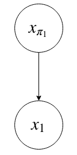

where

- nodes represent random variables
- arrows mean "conditioned on", e.g. "\(x_i\) is conditioned on \(x_{\pi_1}\)".

For example, the graphical model \(p(x_{1, ..., 6})\) is represented as

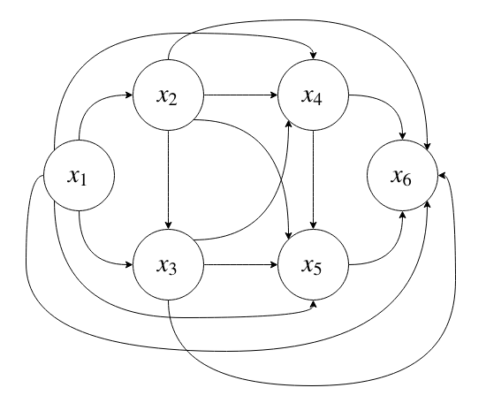

This is what the model looks like with _no assumptions_ on the conditional dependence between variables (said otherwise, we assume full conditional dependence of the joint distribution as per the chain rule). This model will _scale poorly_ (exponential with the number of parameters).

We can simplify the model by building in our assumptions about the conditional probabilites.

### Conditional Independence

Let \(X\) be the set of nodes in our graph (the random variables of our model), then

\\[(X_A \perp X_B | X_C)\\]
\\[\Leftrightarrow p(X_A, X_B | X_C) = p(X_A | X_C)p(X_B | X_C) \; (\star)\\]
\\[\Leftrightarrow p(X_A | X_B, X_C) = p(X_A | X_C) \; (\star\star)\\]

!!! note
    \(\star\star\) is especially important, and we use this several times throughout the lecture.

## Directed acyclic graphical models (DAGM)

A [directed acyclic graphical model](https://en.wikipedia.org/wiki/Graphical_model#Bayesian_network) over \(N\) random variables looks like

\[p(x_{1, ..., N}) = \prod_ip(x_i | x_{\pi_i})\]

where \(x_i\) is a random variable (node in the graphical model) and \(x_{\pi_i}\) are the parents of this node. In other words, the joint distribution of a DAGM factors into a product of conditional distributions, where each random variable (or node) is conditionally dependent on its parent node(s), which could be empty.

!!! tip
    The Wikipedia entry on [Graphical models](https://en.wikipedia.org/wiki/Graphical_model) is helpful, particularly the section on [Bayesian networks](https://en.wikipedia.org/wiki/Graphical_model#Bayesian_network).

Notice the difference between a DAGM and the chain rule for probability we introduced early: we are only conditioning on _parent nodes_ not _every node_. Furthermore, this distribution is exponential in the number of nodes in the parent set, _not all of_ \(N\).

### Independence assumptions on DAGMs

Lets look again at the graphical model \(p(x_{1, ..., 6})\) we introduced above.

First, lets sort the DAGM topologically. The conditional independence of our random variables becomes

\[x_i \bot x_{\widetilde{\pi_i}} | x_{\pi_i}\]

so random variables \(x_i\) and \(x_{\widetilde{\pi_i}}\) are conditional independent of each other but conditional dependent on their parent nodes \(x_{\pi_i}\).

!!! note
    To [topological sort](https://en.wikipedia.org/wiki/Topological_sorting) or order a DAGM means to sort all parents before their children.

Lastly, lets place some assumptions on the conditional dependence of our random variables. Say our model looks like

What have the assumptions done to our joint distribution represented by our model?

\[p(x_{1, ..., 6}) = p(x_1)p(x_2 | x_1)p(x_3 | x_1)p(x_4 | x_2)p(x_5 | x_3)p(x_6 | x_2, x_5)\]

Cleary our assumptions on conditional independence have vastly simplified the model. Suppose each is \(x_i\) is a binary random variable. Our assumptions on conditional independence also reduce the dimensionality of our model

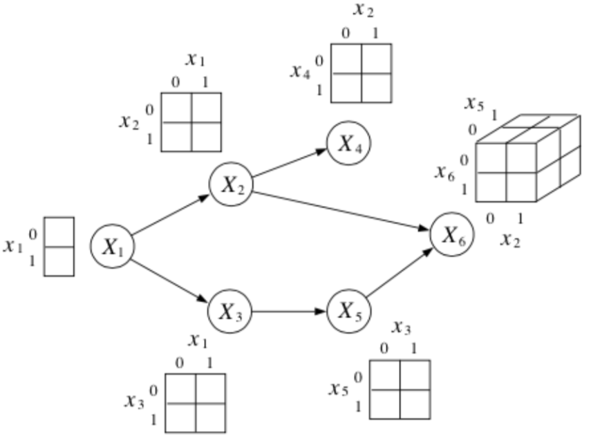

### D-Separation

**D-separation**, or **directed-separation** is a notion of connectedness in DAGMs in which two (sets of) variables _may or may not be connected_ conditioned on a third (set of) variable(s); where D-connection implies conditional _dependence_ and d-separation implies conditional _independence_.

In particular, we say that

\[x_A \bot x_B | x_C\]

if every variable in \(A\) is d-separated from every variable in \(B\) conditioned on all the variables in \(C\). We will look at two methods for checking if an independence is true: A depth-first search algorithm and [Bayes Balls](https://metacademy.org/graphs/concepts/bayes_ball#focus=bayes_ball&mode=learn).

#### DFS Algorithm for checking independence

To check if an independence is true, we can cycle through each node in \(A\), do a depth-first search to reach every node in \(B\), and examine the path between them. If all of the paths are d-separated, then we can assert

\[x_A \bot x_B | x_C\]

Thus, it will be sufficient to consider triples of nodes.

!!! note
    It is not totally clear to me _why_ it is sufficient to consider triples of nodes. This is simply stated "as is" on the lecture slides.

Lets go through some of the most common triples.

!!! tip
    It was suggested in class that these types of examples make for really good midterm questions!

__1. Chain__

_Question_: When we condition on \(y\), are \(x\) and \(z\) independent?

_Answer_:

From the graph, we get

\[P(x, y, z) = P(x)P(y|x)P(z|y)\]

which implies

\begin{align}
P(z | x, y) &= \frac{P(x, y, z)}{P(x, y)} \\
&= \frac{P(x)P(y|x)P(z|y)}{P(x)P(y|x)} \\
&= P(z | y) \\
\end{align}

\(\therefore\) \(P(z | x, y) = P(z | y)\) and so by \(\star\star\), \(x \bot z | y\).

!!! tip
    It is helpful to think about \(x\) as the past, \(y\) as the present and \(z\) as the future when working with chains such as this one.

__2. Common Cause__

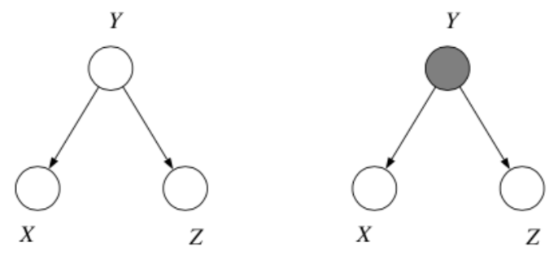

Where we think of \(y\) as the "common cause" of the two independent effects \(x\) and \(z\).

_Question_: When we condition on \(y\), are \(x\) and \(z\) independent?

_Answer_:

From the graph, we get

\[P(x, y, z) = P(y)P(x|y)P(z|y)\]

which implies

\begin{align}
P(x, z | y) &= \frac{P(x, y, z)}{P(y)} \\
&= \frac{P(y)P(x|y)P(z|y)}{P(y)} \\
&= P(x|y)P(z|y) \\
\end{align}

\(\therefore\) \(P(x, z| y) = P(x|y)P(z|y)\) and so by \(\star\), \(x \bot z | y\).

__3. Explaining Away__

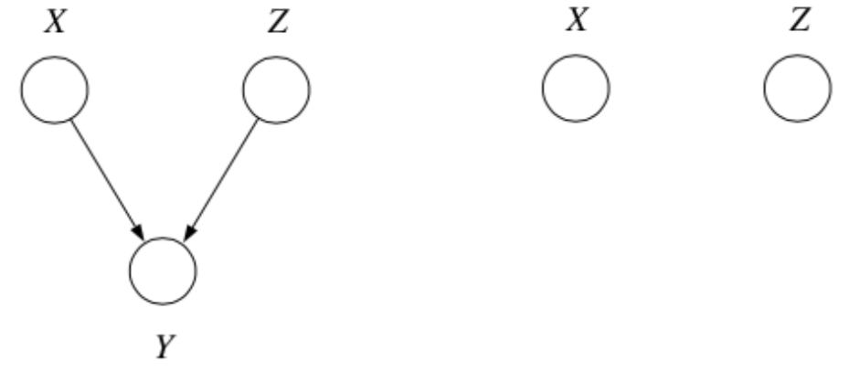

_Question_: When we condition on \(y\), are \(x\) and \(z\) independent?

_Answer_:

From the graph, we get

\[P(x, y, z) = P(x)P(z)P(y|x, z)\]

which implies

\begin{align}
P(z | x, y) &= \frac{P(x)P(z)P(y | x,  z)}{P(x)P(y|x)} \\
&= \frac{P(z)P(y | x,  z)}{P(y|x)}  \\
&\not = P(z|y) \\
\end{align}

\(\therefore\) \(P(z | x, y) \not = P(z|y)\) and so by \(\star\star\), \(x \not \bot z | y\).

In fact, \(x\) and \(z\) are _marginally independent_, but given \(y\) they are _conditionally independent_. This important effect is called explaining away ([Berkson’s paradox](https://en.wikipedia.org/wiki/Berkson%27s_paradox)).

!!! example
    Imaging flipping two coins independently, represented by events \(x\) and \(z\). Furthermore, let \(y=1\) if the coins come up the same and \(y=0\) if they come up differently. Clearly, \(x\) and \(z\) are independent, but if I tell you \(y\), they become coupled!

#### Bayes-Balls Algorithm

An alternative algorithm for determining conditional independence is the [Bayes Balls](https://metacademy.org/graphs/concepts/bayes_ball#focus=bayes_ball&mode=learn) algorithm. To check if \(x_A \bot x_B | x_C\) we need to check if every variable in \(A\) is d-seperated from every variable in \(B\) conditioned on all variables in \(C\). In other words, given that all the nodes in \(x_C\) are "clamped", when we "wiggle" nodes \(x_A\) can we change any of the nodes in \(x_B\)?

In general, the algorithm works as follows: We shade all nodes \(x_C\), place "balls" at each node in \(x_A\) (or \(x_B\)), let them "bounce" around according to some rules, and then ask if any of the balls reach any of the nodes in \(x_B\) (or \(x_A\)).

_The rules are as follows_:

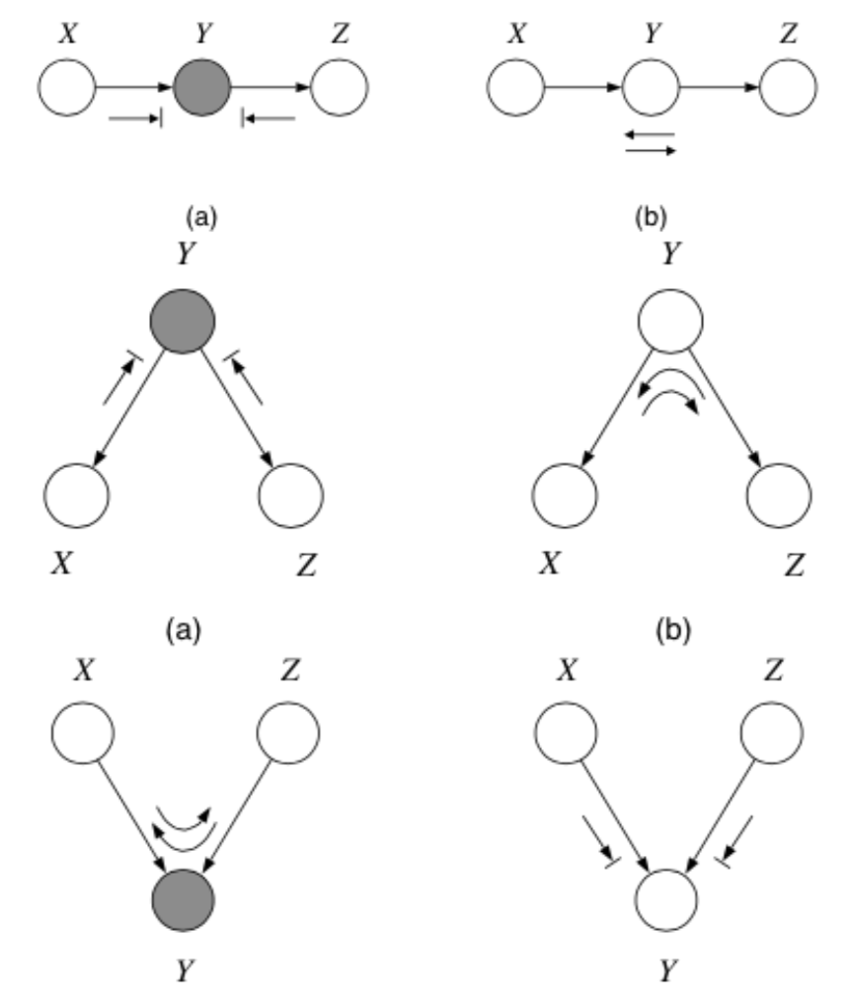

including the _boundary rules_:

where **arrows** indicate paths the balls _can_ travel, and **arrows with bars** indicate paths the balls _cannot_ travel.

!!! note
    Notice balls can travel opposite to edge directions!

Here’s a trick for the explaining away case: If \(y\) _or any of its descendants_ is **shaded**, the ball passes through.

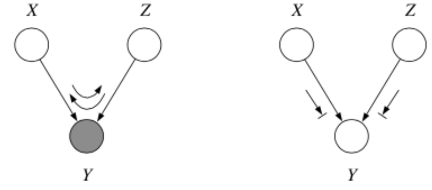

##### Canonical Micrographs

For reference, here are some canonical micrographs and the Bayes Balls algorithmic rules that apply to them

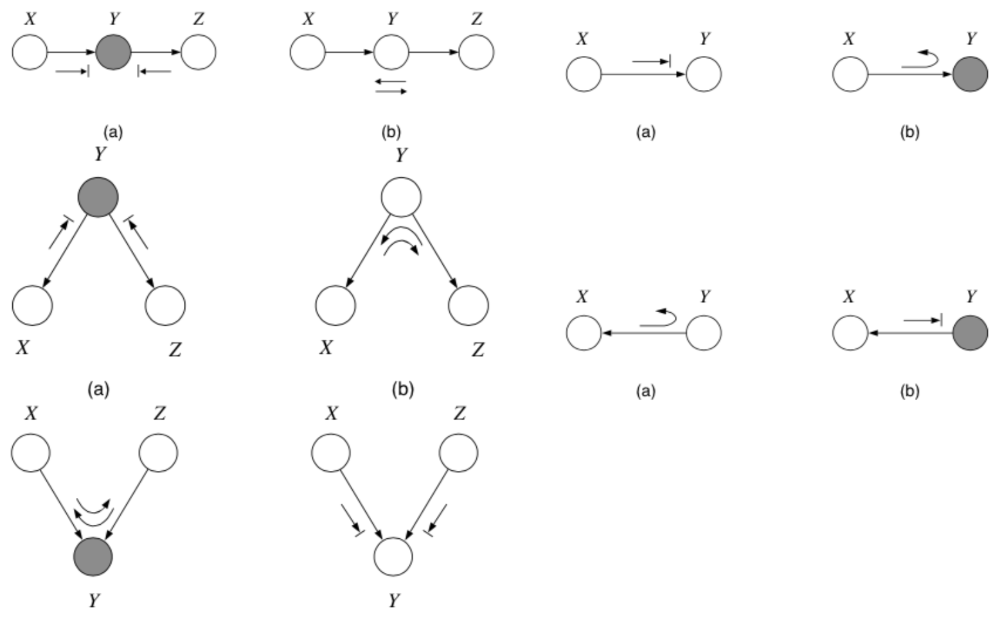

!!! tip
    See [this video](https://www.youtube.com/watch?v=jgt0G2PkWl0) for an easy way to remember all the rules.

##### Examples

_Question_: In the following graph, is \(x_1 \bot x_6 | \{x_2, x_3\}\)?

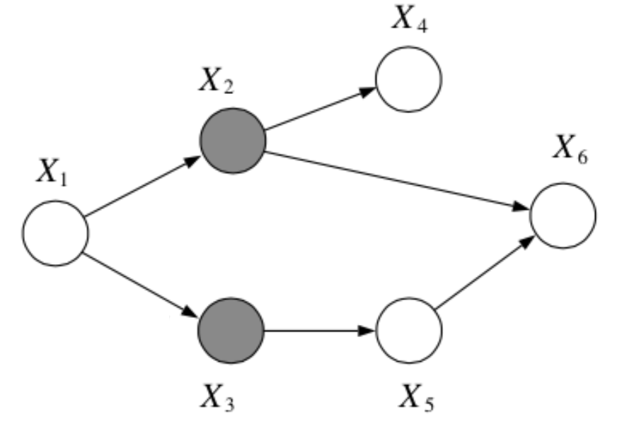

_Answer_:

 Yes, by the Bayes Balls algorithm.

 

 _Question_: In the following graph, is \(x_2 \bot x_3 | \{x_1, x_6\}\)?

 

 _Answer_:

  No, by the Bayes Balls algorithm.

  

### Plates

Because Bayesian methods treat parameters as random variables, we would like to include them in the graphical model. One way to do this is to repeat all the iid observations explicitly and show the parameter only once. A better way is to use __plates__, in which repreaed quantities that are iid are put in a box

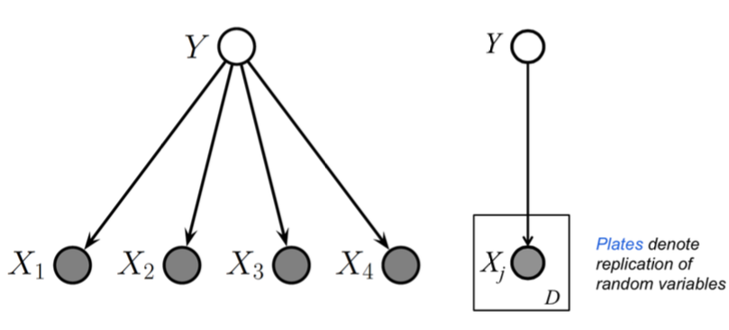

Plates are like “macros” that allow you to draw a very complicated graphical model with a simpler notation.
_The rules of plates are simple_: repeat every structure in a box a number of times given by the integer in the corner of the box (e.g. \(N\)), updating the plate index variable (e.g. \(n\)) as you go. Duplicate every arrow going into the plate and every arrow leaving the plate by connecting the arrows to each copy of the structure.

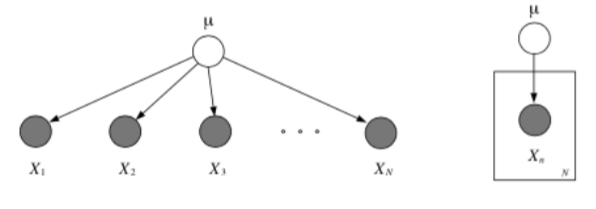

#### Nested Plates

Plates can be nested, in which case their arrows get duplicated also, according to the rule: draw an arrow from every copy of the source node to every copy of the destination node.

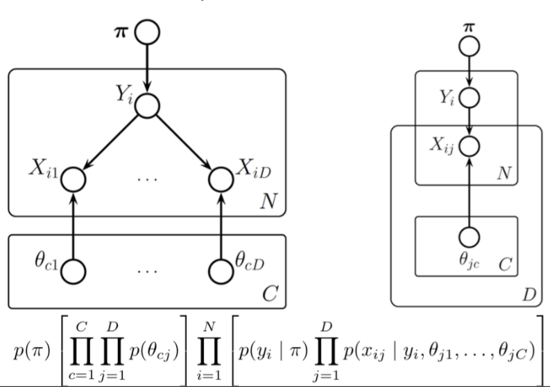

Plates can also cross (intersect), in which case the nodes at the intersection have multiple indices and get duplicated a number of times equal to the product of the duplication numbers on all the plates containing them.

## Appendix

### Useful Resources

- [Metacademy lesson on Bayes Balls](https://metacademy.org/graphs/concepts/bayes_ball#focus=bayes_ball&mode=learn). In fact, that link will bring you to a short course on a couple important concepts for this corse, including conditional probability, conditional independence, Bayesian networks and d-separation.
- [A video](https://www.youtube.com/watch?v=jgt0G2PkWl0) on how to memorize the Bayes Balls rules (this is linked in the above course).

### Glossary of Terms
