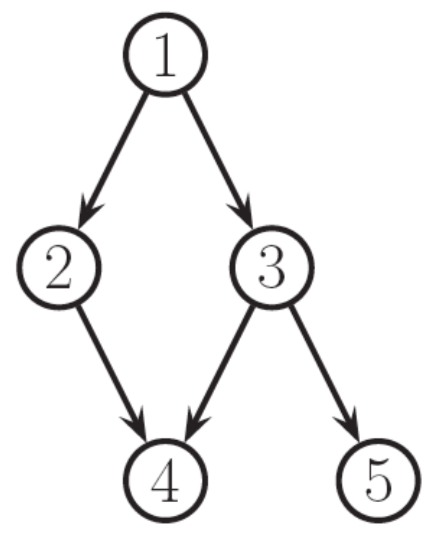
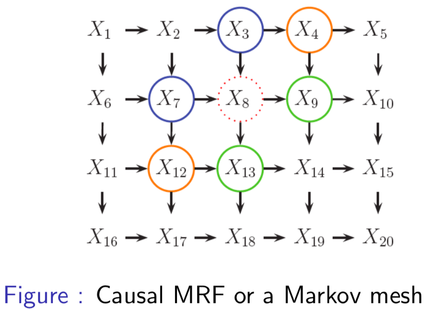
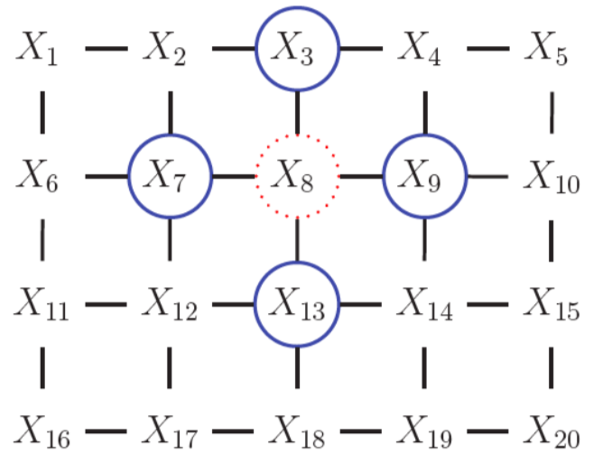
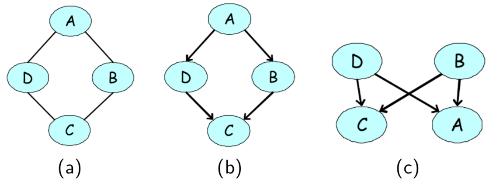
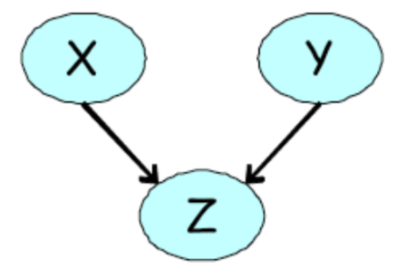
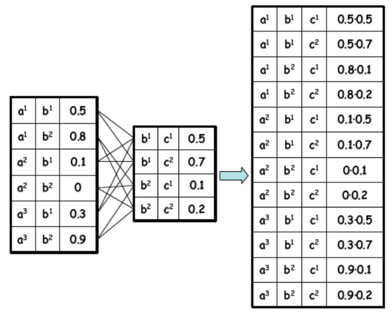

# Week 4: Undirected Graphical Models

### Assigned Reading

- Murphy: Chapters 19-19.5

### Overview

- Will fill out when I get my notebook back.

## Directed Graphical Models (a Review)

So far, we have seen [directed acyclic graph models (DAGMs)](../week_3/). These models represent large joint distributions using _local_ relationships specified by the graph, where each random variable is a node and the edges specify the conditional dependence between random variables (and therefore missing edges imply conditional independence). Graphically, these models looked like

The graph factorized according to the local conditional probabilities

\[
p(x_{1, ..., N}) = \prod_i^Np(x_i | x_{\pi_i})
\]

where \(x_{\pi_i}\) are the parents of node \(x_i\).

Each node is conditionally independent of its non-descendents given its parents

\[\
\{x_i \bot x_{\tilde\pi_i} | x_{\pi_i}\} \quad \forall_i
\]

!!! note
    Recall that this is simply a topological ordering of the graph (i.e. parents have lower numbers than their children)

For discrete variables, _each node_ stores a [conditional probability table](https://en.wikipedia.org/wiki/Conditional_probability_table) (CPT) of size \(k^n\), where \(k\) is the number of discrete states and \(n\) the number of conditionally dependent nodes.

### Are DAGMs always useful?

For some problems, it is not always clear how to choose the direction for the edges in our DAGMs. Take the example of modeling dependencies in an image

our assumptions lead to unatural conditional independence between random variables. Take for example, the [Markov blanket](https://en.wikipedia.org/wiki/Markov_blanket) of node \(X_8\)

\[
mb(8) = \{3, 7\} \cup \{9, 13\} \cup \{12, 4\}
\]

!!! note
    The [Markov blanket](https://en.wikipedia.org/wiki/Markov_blanket) contains the parents, children and co-parents of a node. More generally, it is the set of all variables that shield the node from the rest of the network.

An alternative to DAGMs, is undirected graphical models (UGMs).

## Undirected Graphical Models

Undirected graphical models (UDGMs), also called [Markov random fields](https://en.wikipedia.org/wiki/Markov_random_field) (MRFs) or Markov networks, is a set of random variables described by an undirected graph. As in DAGMs, the _nodes_ in the graph represent _random variables_. However, in contrast to DAGMs, edges represent _probabilistic interactions_ between neighboring variables (as opposed to conditional dependence).

### Dependencies in UGMs

In DGMs, we used conditional probabilities to represent the distribution of nodes given their parents. In UGMs, we use a more _symmetric_ parameterization that captures the affinities between related variables:

_def_. **Global Markov Property**: \(X_A \bot X_B | X_C\) iff C separates A from B (i.e. there is no path in the graph between A and B that doesn't go through C).

_def_. **Markov Blanket (local property)**: The set of nodes that renders a node \(t\) conditionally independent of all the other nodes in the graph

\[
t \bot \mathcal V \setminus cl(t) | mb(t)
\]

_def_. **Pairwise (Markov) Property**: The set of nodes that renders a node \(t\) conditionally independent of all the other nodes in the graph

\[
s \bot t | \mathcal V \setminus \{s, t\} \Leftrightarrow G_{st} = 0
\]

where

\[
G \Rightarrow L \Rightarrow P \Rightarrow P \quad p(x) > 0
\]

#### Simple example

- Global: \(\{1, 2\} \bot \{6, 7\} | \{3, 4, 5\}\)
- Local: \(1 \bot \text{rest} | \{2, 3\}\)
- Pairwise: \(1 \bot 7 | \text{rest}\)

#### Image example

!!! error
    I don't know how to solve the examples on the lecture slides (slide 11). Leaving blank for now.

### Not all UGMs can be represented as DGMs

Take the follow UGM for example (a) and our attempts at encoding this as a DGM (b, c).

First, note the two conditional independencies of our UGM in (a):

1. \(A \bot C|D,B\)
2. \(B \bot D|A,C\)

In (b), we are able to encode the first independence, but not the second (i.e., our DGM implies that B is dependent on D given A and C). In (c), we are again able to encode the first independence, but our model also implies that B and D are marginally independent.

### Not all DGMs can be represented as UGMs

It is also true that not all DGMs can be represented as UGMs. One such example is the 'V-structure' that we saw in the **explaining away** case in [lecture 3](../week_3/#dfs-algorithm-for-checking-independence).

An undirected model is unable to capture the marginal independence, \(X \bot Y\) that holds at the same time as \(\neg (X \bot Y | Z )\).

### Cliques

A [**clique**](https://en.wikipedia.org/wiki/Clique_(graph_theory)) in an undirected graph is a subset of its vertices such that every two vertices in the subset are connected by an edge (i.e., the subgraph induced by the clique is [complete](https://en.wikipedia.org/wiki/Complete_graph)).

_def_. The [**maximal clique**](https://en.wikipedia.org/wiki/Clique_(graph_theory)#Definitions) is a clique that cannot be extended by including one more adjacent vertex.

_def_. The **maximum clique** is a clique of the _largest possible size_ in a given graph.

For example, in the following graph a _maximal clique_ is show in blue, while the _maximum clique_ is shown in green.

### Parameterization of an UGM

Let \(x = (x_1, ..., x_m)\) be the set of all random variables in our graph. Unlike in DGMs, there is no topological ordering associated with an undirected graph, and so we _cannot_ use the chain rule to represent \(p(x)\). Therefore, instead of associating conditional probabilities to each node, we associate __potential functions__ or __factors__ with each _maximal clique_ in the graph.

For a given clique \(c\), we define the potential function or factor

\[
\psi_c(x_c | \theta_c)
\]

to be any non-negative function, where \(x_c\) is some subset of variables in \(x\).

The joint distribution is the _proportional_ to the _product of clique potentials_.

!!! note
    Any positive distribution whose conditional independencies are represented with an UGM can be represented this way.

_More formally_,

A positive distribution \(p(x) > 0\) satisfies the conditional independence properties of an undirected graph \(G\) iff \(p\) can be represented as a product of factors, one per maximal clique, i.e.,

\[
p(x | \theta) = \frac{1}{Z(\theta)}\prod_{c \in \mathcal C}\psi_c(x_c | \theta)
\]

where \(\mathcal C\) is the set of all (maximal) clique of \(G\), and \(Z(\theta)\) the **partition function**, defined as

\[
Z(\theta)= \sum_x \prod_{c \in \mathcal C} \psi_c(x_c|\theta_c)
\]

The factored structure of the distribution makes it possible to more efficiently do the sums/integrals needed to compute it. Lets see how to factorize the undirected graph of our running example:

\[
p(x) \propto \psi_{1, 2, 3}(x_1, x_2, x_3) \psi_{2, 3, 5}(x_2, x_3, x_5) \psi_{2, 4, 5}(x_2, x_4, x_5) \psi_{3, 5, 6}(x_3, x_5, x_6) \psi_{4, 5, 6, 7}(x_4, x_5, x_6, x_7)
\]

If the variables are discrete, we can represent the potential or energy functions as tables of (non-negative) numbers

\[
p(A, B, C, D) = \frac{1}{Z} \psi_{a, b}(A, B) \psi_{b, c}(B, C) \psi_{c, d}(C, D) \psi_{a, d}(A, D)
\]

!!! error
    Why the switch from \(\psi\) to \(\phi\) here?

It is important to note that these potential are _not_ probabilities, but represent compatibilities between the different assignments.

#### Factor product

Given 3 disjoint sets of variables \(X, Y, Z\) and factors \(\psi_1(X, Y)\), \(\psi_2(Y, Z)\) the **factor product** is defined as:

\[
\psi_{X, Y, Z}(X, Y, Z) = \psi_{X, Y}(X, Y)\phi_{Y, Z}(Y, Z)
\]

!!! error
    Again, is the the switch from \(\psi\) to \(\phi\) a typo? Deliberate?
