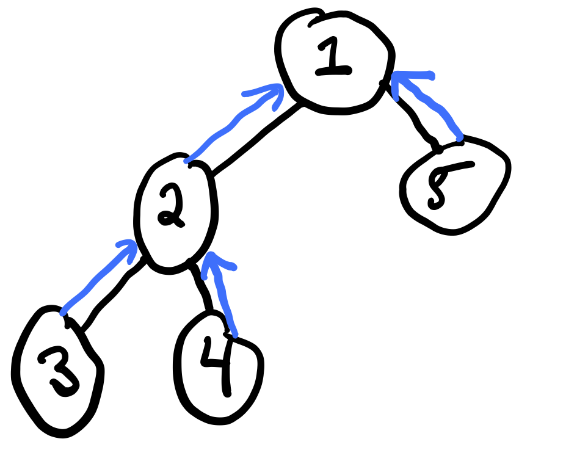
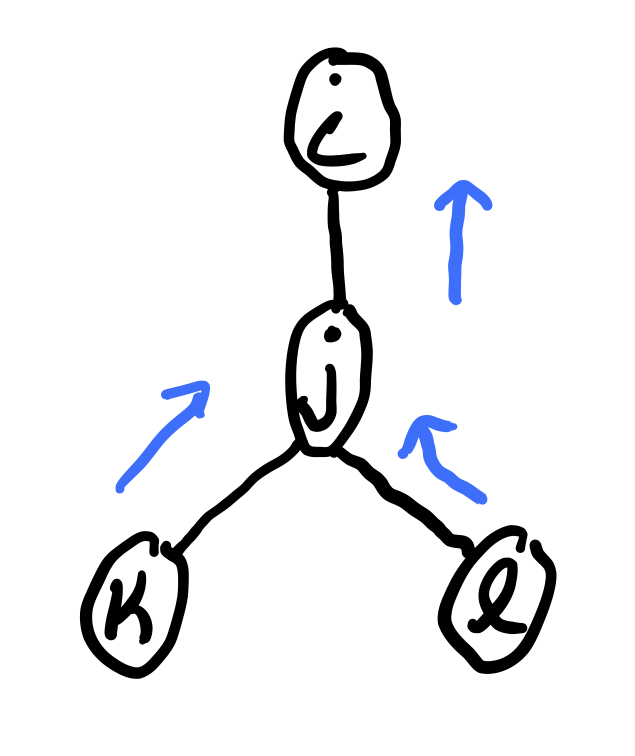

## Choosing an Elimination Ordering

To choose an elimination ordering, we use a set of heuristics:

- __Min-fill__: the cost of a vertex is the number of edges that need to be added to the graph due to its elimination.
- __Weighted-Min-Fill__: the cost of a vertex is the sum of weights of the edges that need to be added to the graph due to its elimination. Weight of an edge is the product of weights of its constituent vertices.
- __Min-neighbors__: the cost of a vertex is the number of neighbors it has in the current graph.
- __Min-weight__: the cost of a vertex is the product of weights (domain cardinality) of its neighbors.

None of these criteria are _better_ than the others. You often just have to try several.

!!! error
    Skipped the section from lecture that came between __Choosing an Elimination Ordering__ and __Belief Propogation__.

### Belief Propagation

What if we want \(p(x_i) \ \forall x_i \in X\)? We could run variable elimination for each variable \(x_i\), but this is computationally expensive. Can we do something more efficient?

Consider a tree:

\[
P(X_{1:n}) = \frac{1}{z} \prod \phi(x_i) \prod_{(i, j) \in T} \phi_{i, j}(x_i, x_j)
\]

We can compute the sum product belief propagation in order to compute all marginals with just two passes. Belief propagation is based on message-passing of "messages" between neighboring vertices of the graph.

The message sent from variable \(j\) to \(i \in N(j)\) is

\[
m_{j \rightarrow i}(x_i) = \sum_{x_j}\phi_j(x_j)\phi_{ij}(x_i, x_j)\prod_{k \in N(j) \not = i} m_{k \rightarrow j}(x_j)
\]

where each message \(m_{j \rightarrow i}(x_i)\) is a vector with one value for each state of \(x_i\).
