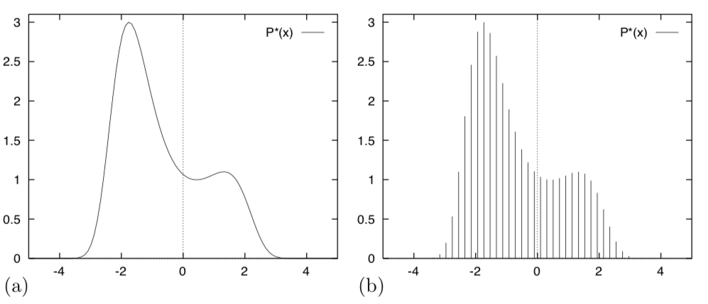
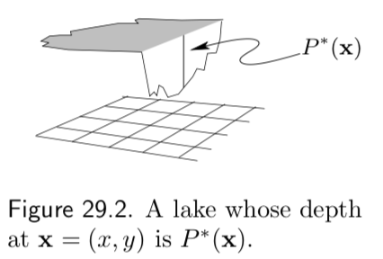
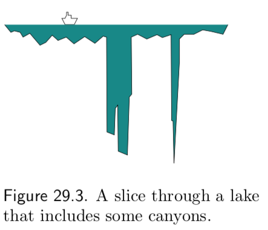

# Week 8:  Sampling and Monte Carlo Methods

### Assigned Reading

- MacKay: Chapter 29

### Overview

- Simple Monte Carlo
- Importance Sampling
- Rejection Sampling
- Metropolis Hastings
- Gibbs
- Properties of Markov Chains

We are going to put a pause on variational methods and return to them in a few weeks. Today we will talk about [**sampling**](https://en.wikipedia.org/wiki/Sampling_(statistics)): ways to compute the joint probability in a tractable way.

## Sampling

We will use the word "_sample_" in the following sense: a sample from a distribution \(p(x)\) is a single realization \(x\) whose probability distribution is \(p(x)\). This contrasts with the alternative usage in statistics, where _sample_ refers to a collection of realizations \({x}\).

Recall from last week that we assume the density from which we wish to draw samples, \(p(x)\), can be evaluated to within a multiplicative constant. That is, we can evaluate a function \(\tilde p(x)\) such that

\[
p(x) = \frac{\tilde p(x)}{Z}
\]

## The problems to be solved

[**Monte Carlo methods**](https://en.wikipedia.org/wiki/Monte_Carlo_method) are computational techniques that make use of random numbers. The aims of Monte Carlo methods are to solve one or both of the following problems.

__Problem 1__: To generate samples \(\{x^{(r)}\}^R_{r=1}\) from a given probability distribution \(p(x)\).

__Problem 2__: To estimate expectations of functions, \(\phi(x)\), under this distribution, \(p(x)\)

\[
\Phi = \mathbb E_{x \sim p(x)}[\phi(x)] = \int \phi(x)p(x)dx
\]

!!! warning
    \(\phi\) is unrelated to the factors we talked about in week 6; here it is just some function we want to compute the expectation of.

### Simple example

Simple examples of functions \(\phi(x)\) whose expectations we might be interested in include the first and second moments of quantities that we wish to predict, from which we can compute means and variances; for example if some quantity \(t\) depends on \(x\), we can find the mean and variance of \(t\) under \(p(x)\) by finding the expectations of the functions \(\phi_1(x) = t(x)\) and \(\phi_2(x) = (t(x))^2\)

\[
\phi_1(x) = t(x) \Rightarrow \Phi_1 = \mathbb E_{x \sim p(x)}[\phi_1(x)] \Rightarrow \text{mean}(t) = \Phi_1 \\
\phi_2(x) = (t(x))^2 \Rightarrow \Phi_2 = \mathbb E_{x \sim p(x)}[\phi_2(x)] \Rightarrow \text{var}(t) = \Phi_2 - (\Phi_2)^2 \\
\]

### Simple Monte Carlo

We will concentrate on the first problem (sampling), because if we have solved it, then we can solve the second problem by using the random samples \(\{x^{(r)}\}^R_{r=1}\) to give an estimator.

_def_. **Simple Monte Carlo**: Given \(\{x^{(r)}\}^R_{r=1} \sim p(x)\) we estimate the expectation \(\mathbb E_{x \sim p(x)}[\phi(x)]\) to be the estimator \(\hat \Phi\)

\[
\Phi = \mathbb E_{x \sim p(x)}[\phi(x)] \approx \frac{1}{R}\sum_{r=1}^R \phi(x^{(r)}) = \hat \Phi
\]

#### Properties of MC

If the vectors \(\{x^{(r)}\}^R_{r=1}\) are generated from \(p(x)\) then the expectation of \(\hat \Phi\) is \(\Phi\). E.g. \(\hat \Phi\) is an [unbiased estimator](https://en.wikipedia.org/wiki/Bias_of_an_estimator) of \(\Phi\).

_Proof_

\[
\mathbb E [\hat \Phi]_{x \sim p(\{x^{(r)}\}^R_{r=1})} = \mathbb E \bigg [ \frac{1}{R}\sum_{r=1}^R \phi(x^{(r)}) \bigg ] \\
= \frac{1}{R} \sum_{r=1}^R \mathbb E \big [ \phi(x^{(r)}) \big ]  \\
= \frac{1}{R} \sum_{r=1}^R \mathbb E_{x \sim p(x)} \big [ \phi(x) \big ] \\
= \frac{R}{R} \mathbb E_{x \sim p(x)} \big [ \phi(x) \big ] \\
= \Phi \quad \square
\]

As the number of samples of \(R\) increases, the variance of \(\hat \Phi\) will decrease proportional to \(\frac{1}{R}\)

_Proof_

\[
\text{var}[\hat \Phi] = \text{var} \bigg [ \frac{1}{R}\sum^R_{r=1}\phi(x^{(r)}) \bigg ] \\
= \frac{1}{R^2} \text{var} \bigg [\sum^R_{r=1}\phi(x^{(r)}) \bigg ]\\
= \frac{1}{R^2} \sum^R_{r=1} \text{var} \bigg [\phi(x^{(r)}) \bigg ] \\
= \frac{R}{R^2} \text{var} [\phi(x) ] \\
= \frac{1}{R} \text{var} [\phi(x) ] \quad \square
\]

!!! important
    The accuracy of the Monte Carlo estimate depends only on the variance of \(\phi\), not on the dimensionality of the \(x\). So regardless of the dimensionality of \(x\), it may be that as few as a dozen independent samples \(\{x^{(r)}\}\) suffice to estimate \(\phi\) satisfactorily.

#### Sampling _p(x)_ is hard

Earlier we said that we will assume we can sample from the density \(p(x)\) to within a multiplicative constant

\[
p(x) = \frac{\tilde p(x)}{Z}
\]

If we can evaluate \(\tilde p(x)\), then why can't we solve problem 1? There are two difficulties

1. We do not typically know the normalizing constant, \(Z\)
2. Even if we did know \(Z\), the problem of drawing samples from \(p(x)\) is still a challenging one, especially in high-dimensional spaces, because there is no obvious way to sample from \(p\) without enumerating most or all of the possible states.

!!! note
    Correct samples from \(p\) will by definition tend to come from places in \(x\)-space where \(p(x)\) is big; how can we identify those places where \(p(x)\) is big, without evaluating \(p(x)\) everywhere? There are only a few high-dimensional densities from which it is easy to draw samples, for example the Gaussian distribution.

First, we will build our intuition for why sampling from \(p\) is difficult. In the next section, will discuss clever Monte Carlo methods can solve them.

##### Bad Idea: Lattice Discretization

Imagine that we wish to draw samples from the density

\[
p(x) = \frac{\tilde p(x)}{Z}
\]

given in figure (a).

Just because we can plot this distribution, that does not mean we can draw samples from it. To start, we don't know the normalizing constant, \(Z\).

To simplify the problem, we could discretize the variable \(x\) and sample from the discrete probability distribution over a finite set of uniformly spaced points \(\{x_i\}\) (figure (d)). If we evaluate \(\tilde p_i = \tilde p(x_i)\) at each point \(x_i\), we could compute

\[
Z = \sum_i \tilde p_i
\]

and

\[
\tilde p_i = \frac{\tilde p_i}{Z}
\]

and could sample from the probability distribution \(\{p_i\}_{i=1}^R\) using various methods based on a source of random bits. Unfortunately, the cost of this procedure is intractable.

To evaluate \(Z\), we must visit every point in the space. In figure (b) there are \(50\) uniformly spaced points in one dimension. If our system had, \(N=1000\) dimensions say, then the corresponding number of points would be \(50^{D} = 50^{1000}\). Even if each component \(x_n\) took only two discrete values, the number of evaluations of \(\tilde p\) needed to evaluate \(Z\) would take many times longer than the age of the universe.

!!! tip
    **TL;DR** The cost of this lattice discretization method of sampling from \(p(x)\) is exponential in the dimension of our data (e.g. \(D^N\) where \(D\) is the number of data points and \(N\) their dimension).

##### A useful analogy

Imagine the tasks of drawing random water samples from a lake and finding the average plankton concentration (figure 29.2). Let

- \(\tilde p({\bf x})\) = the depth of the lake at \({\bf x} = (x, y)\)
- \(\phi({\bf x})\) = the plankton concentration as a function of \({\bf x}\)
- \(Z\) = the volume of the lake = \(\int \tilde p({\bf x }) d{\bf x }\)

The average concentration of plankton is therefore

\[
\Phi = \frac{1}{Z} \int \phi({\bf x }) \tilde p({\bf x }) d{\bf x }
\]

Say you can take the boat to any desired location \({\bf x }\) on the lake, and can measure the depth, \(\tilde p({\bf x })\), and plankton concentration, \(\phi({\bf x})\), at that point. Therefore,

- __Problem 1__ is to draw water samples at random from the lake, in such a way that each sample is equally likely to come from any point within the lake.
- __Problem 2__ is to find the average plankton concentration.

These are difficult problems to solve because at the outset we know nothing about the depth \(\tilde p({\bf x })\). Perhaps much of the volume of the lake is contained in narrow, deep underwater canyons (figure 29.3), in which case, to correctly sample from the lake and correctly estimate \(\Phi\) our method must implicitly discover the canyons and find their volume relative to the rest of the lake.

## Monte Carlo Methods

### Importance Sampling

[**Importance sampling**](https://en.wikipedia.org/wiki/Importance_sampling) is not a method for generating samples from \(p(x)\) (**Problem 1**); it is just a method for estimating the expectation of a function \(\phi(x)\) (**Problem 2**).

!!! tip
    Importance sampling can be viewed as a generalization of the **uniform sampling** method, something we did not discuss in class but is discussed in MacKay: Chapter 29.

We begin with the same assumption we have made earlier; the density from which we wish to draw samples, \(p(x)\), can be evaluated to within a multiplicative constant. That is, we can evaluate a function \(\tilde p(x)\) such that

\[
p(x) = \frac{\tilde p(x)}{Z}
\]
