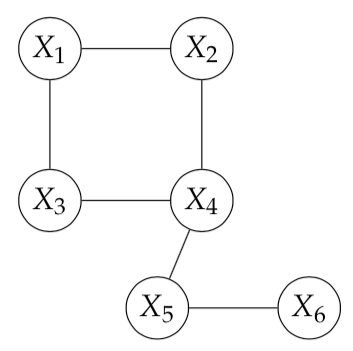

# Sample Midterm (Answers)

## Question 2

Consider the following directed graphical model:

(a) List all variables that are independent of \(A\) given evidence on \(B\)

By Bayes' Balls

\[
I \bot A | B
\]

(b) Write down the factorized normalized joint distribution that this graphical model represents.

\[
p(A, ..., I) = p(A | B, C)P(B | D)P(C | E, F)P(D | G)P(E | G)P(F | H)P(G)P(H)P(I | G, H)
\]

(c) If each node is a single discrete random variable in \({1, ..., K}\) how many distinct joint states can the model take? That is, how many different configurations can the variables in this model be set?

For each node (random variable) there is \(k\) states. We therefore have \(k^n\) possible configurations per node (\(x_i\)) where \(k\) is the number of states and \(n\) the number of parent nodes (\(x_{\pi_i}\))

Graphically:

Together, there are \(k^{3 + 2 + 3 + 2 + 2 + 2 + 1 + 1 + 3} = k^{19}\) possible different configurations of the variables in this model.
